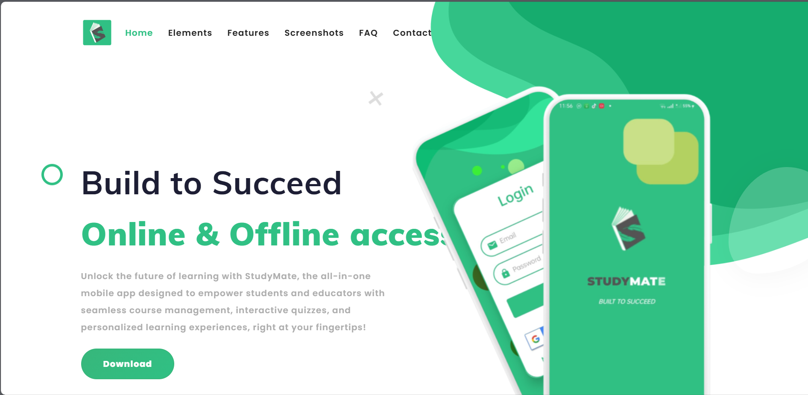
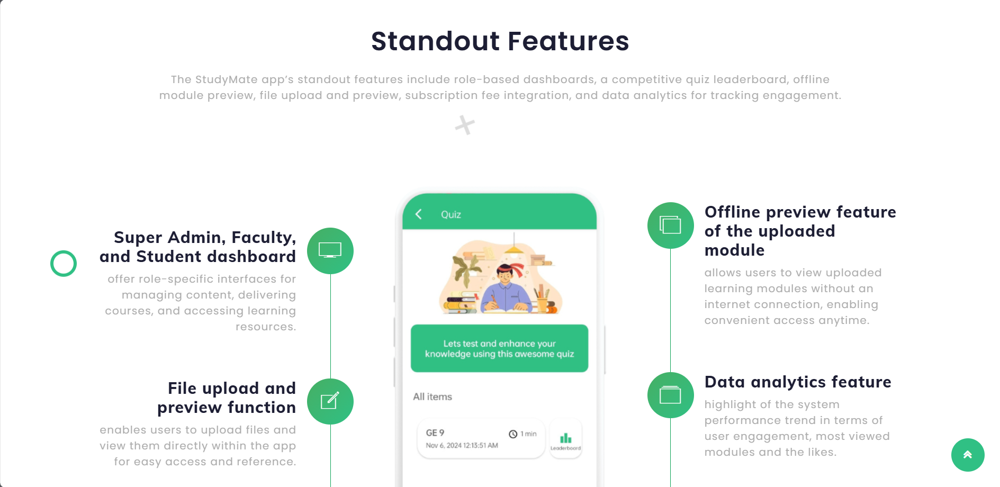
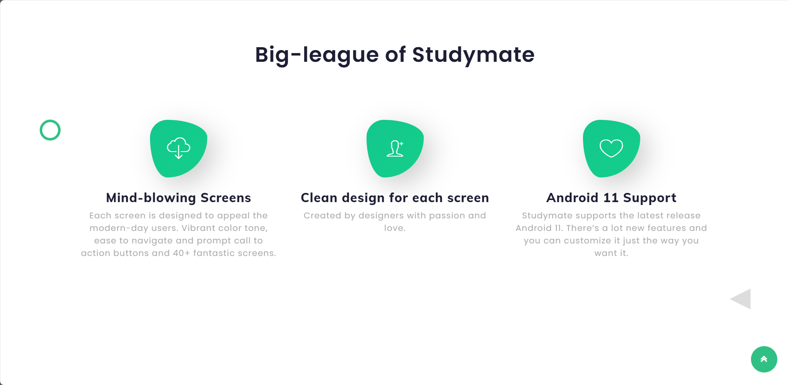
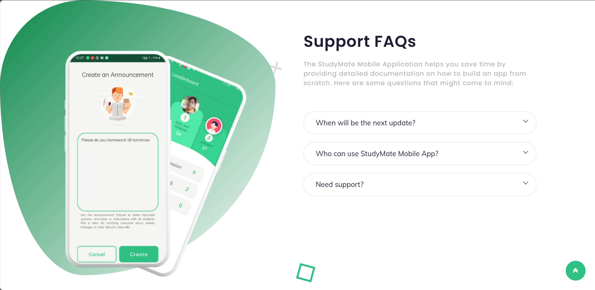
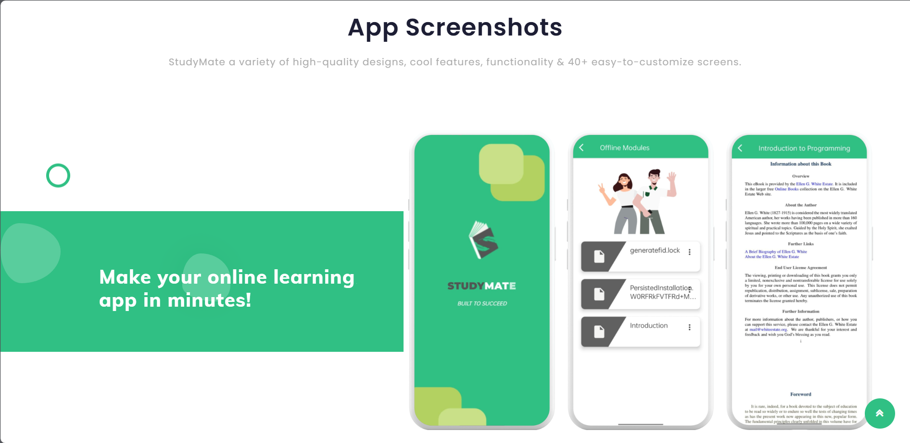

# 📚 StudyMate Website

Welcome to the **StudyMate** website repository! 🎉 This project is a beautifully designed educational platform aimed at enhancing your study experience with interactive features and a clean, modern UI. 🚀

---

## 🎨 UI Preview

### Homepage
- 
  The main homepage showcasing the overall layout and key features of StudyMate.

### Features Section
- 
  Highlights the core features available on the platform, such as study tools and resources.

### Elements
- 
  Displays various UI elements like buttons, forms, and interactive components used throughout the site.

### FAQ Section
- 
  The Frequently Asked Questions section to help users find quick answers.

### Screenshots
- 
  A collection of screenshots demonstrating different pages and functionalities of the website.

---

## 🚀 Getting Started

To view the website, simply open the `index.html` file in your preferred web browser. Enjoy exploring the StudyMate platform!

---

## 📁 Project Structure

```
studymate-website/
├── index.html                          # Main homepage file
├── README.md                           # Project documentation
├── studymate_icon.svg                  # Website icon
├── TODO.md                             # Task list
├── assets/                             # Static assets
│   ├── css/                            # Stylesheets
│   │   ├── all.min.css
│   │   ├── bootstrap.min.css
│   │   ├── font-awesome.min.css
│   │   ├── ionicons.min.css
│   │   ├── magnific-popup.css
│   │   ├── responsive.css
│   │   ├── style.css
│   │   ├── wow.css
│   │   ├── color/                      # Color themes
│   │   │   ├── color-1.css
│   │   │   ├── color-2.css
│   │   │   ├── color-3.css
│   │   │   ├── color-4.css
│   │   │   ├── color-5.css
│   │   │   ├── color-6.css
│   │   │   ├── color-7.css
│   │   │   └── color-8.css
│   │   ├── owl-carousel/               # Owl Carousel styles
│   │   │   └── owl.carousel.css
│   │   └── slick/                      # Slick slider styles
│   │       └── slick.css
│   ├── fonts/                          # Font files
│   │   ├── fontawesome-webfont.eot
│   │   ├── fontawesome-webfont.svg
│   │   ├── fontawesome-webfont.ttf
│   │   ├── fontawesome-webfont.woff
│   │   ├── fontawesome-webfont.woff2
│   │   ├── FontAwesome.otf
│   │   ├── ionicons.eot
│   │   ├── ionicons.svg
│   │   ├── ionicons.ttf
│   │   └── ionicons.woff
│   ├── images/                         # Image assets
│   │   ├── elements.png
│   │   ├── faq.png
│   │   ├── favicon.png
│   │   ├── features.png
│   │   ├── home.png
│   │   ├── loader.gif
│   │   ├── logo.png
│   │   ├── screenshots.png
│   │   ├── about-us/                   # About us images
│   │   │   ├── about-phone.png
│   │   │   ├── backimg.png
│   │   │   ├── faq-phone.png
│   │   │   ├── features-img1.png
│   │   │   └── main.png
│   │   ├── banner/                     # Banner images
│   │   │   └── 1.png
│   │   ├── download/                   # Download section images
│   │   │   └── download.png
│   │   └── screenshots/                # App screenshots
│   │       ├── 1.png
│   │       ├── 2.png
│   │       ├── 3.png
│   │       ├── 4.png
│   │       ├── 5.png
│   │       ├── 6.png
│   │       ├── 7.png
│   │       ├── 8.png
│   │       ├── 9.png
│   │       ├── 10.png
│   │       └── 11.png
│   └── js/                             # JavaScript files
│       ├── bootstrap.min.js
│       ├── counter.js
│       ├── custom.js
│       ├── jquery-3.3.1.min.js
│       ├── main.js
│       ├── owl.carousel.min.js
│       ├── pattern-trianglify.js
│       ├── popper.min.js
│       ├── typer.js
│       ├── wow.min.js
│       └── slick/                      # Slick slider scripts
│           └── slick.min.js
├── css/                                # Empty directory (can be removed)
├── fonts/                              # Empty directory (can be removed)
├── images/                             # Empty directory (can be removed)
├── js/                                 # Empty directory (can be removed)
└── src/                                # Source files
    └── app/
        └── index.html                  # Alternative app page
```

---

## 📄 License

This project is licensed under the MIT License. Feel free to use and modify it as you like! 😊

---

Thank you for checking out the StudyMate website! If you have any questions or feedback, please reach out. Happy studying! 📖✨
